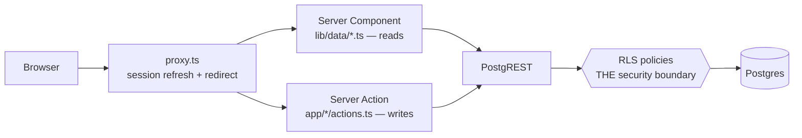

Sergio Betancur Chaves

# Credit Count — Technical Design Document

Track two numbers that must never be confused — **credits** (distinct coasters ridden) and
**rides** (times ridden) — with ride history private by default.

## 1. Agent Instructions

**Loop:** write the failing test → run it, confirm it fails → implement → run it, confirm it
passes → `pnpm db:types` if the schema moved → `pnpm typecheck && pnpm lint && pnpm test`.

```bash
pnpm dev | build | typecheck | lint          # app
pnpm test | test:unit | test:rls             # vitest (test:rls needs the local stack)
pnpm exec supabase start                     # local stack (Docker)
pnpm db:reset | db:test | db:types           # migrations+seed | pgTAP | regenerate types
pnpm db:seed:remote                          # seed a HOSTED project via the Admin API
node scripts/walkthrough.mjs                 # end-to-end, needs a running dev server
```

| MUST | MUST NOT |
|---|---|
| Use `pnpm` | Run `npm` / `npx` |
| Change schema via a new `supabase/migrations/*.sql` | Write ad-hoc DDL |
| Run `pnpm db:types` after every migration | Edit `lib/database.types.ts` (generated) |
| Take `user_id` from the verified session | Trust any `user_id` in a payload |
| Derive credits at read time | Add a stored `credit_count` column or `credits` table |
| Leave `public_leaderboard` definer-rights | Add any policy on `ride` for admins |
| Ask the user about env values | Read or write `.env*`, or install unlisted packages |

## 2. Acceptance Criteria

| # | Criterion |
|---|---|
| A1 | An enthusiast MUST read/insert/update/delete only `ride` rows where `auth.uid() = user_id`. |
| A2 | Selecting another user's rides MUST return `[]` with **no error**. |
| A3 | An admin selecting `ride` MUST receive `[]` — there is no admin policy on that table. |
| A4 | An insert attributed to another `user_id` MUST fail with `42501`. |
| A5 | An update/delete against another user's ride MUST affect zero rows and MUST NOT raise. |
| A6 | Only an admin MAY write `coasters`; any authenticated user MAY read them. |
| A7 | An unauthenticated visitor MUST reach `public_leaderboard` and nothing else. |
| A8 | A user MUST NOT change their own `role`. |
| B1 | A profile appears on the board only when `leaderboard_opt_in = true`. |
| B2 | A profile with zero rides MUST NOT appear, opted in or not. |
| B3 | The view MUST expose exactly `display_name` and `credit_count`. |
| B4 | The view MUST expose no filterable identifier. |
| C1 | Credits MUST be `count(distinct coaster_id)`, computed at read time. |
| C2 | Deleting the only ride of a coaster MUST decrease credits by 1. |
| D1 | Email and password only. No third-party sign-in. |
| D2 | Signup with a registered email MUST be a silent no-op — no error, no email. |
| D3 | Sign-in MUST NOT distinguish "no such account" from "wrong password". |
| D4 | `role` and `leaderboard_opt_in` MUST come from the trigger, never the signup payload. |
| D5 | The server MUST call `getUser()`, never `getSession()`. |

## 3. Architecture

**Stack:** Next.js 16 (App Router) · React 19 · Supabase (Postgres, GoTrue, RLS) ·
`@supabase/ssr` · zod · **pnpm** · vitest + pgTAP.



`proxy.ts` and the `require*` guards redirect people off pages that would only error. They
are a convenience. A request that skips them still returns nothing, because the policies
are attached to the tables.

![[System Design.png]]

### Data model

![[DB Model.png]]

> Superseded by the diagram below: keys are UUIDs, there is no `email` or `password`
> column (Auth owns credentials), and the table is `profiles`, not `users`.

```mermaid
erDiagram
    auth_users ||--|| profiles : "on_auth_user_created"
    auth_users ||--o{ ride : owns
    coasters   ||--o{ ride : "ridden as"

    auth_users { uuid id PK "Auth owns email + password" }
    profiles {
        uuid    id PK_FK "= auth.users.id, cascade"
        text    username "unique, 1..40"
        enum    role "enthusiast | admin"
        boolean leaderboard_opt_in "default false"
    }
    coasters {
        uuid id PK
        text name
        text park
        text country
        text manufacturer
        enum type "Steel | Wooden | Hybrid"
    }
    ride {
        uuid id PK
        uuid user_id FK "auth.users, cascade"
        uuid coaster_id FK "coasters, RESTRICT"
        date ridden_on "check: not future"
        text note "nullable, <= 500"
    }
```

## 4. Detailed Design

```
app/(auth)|dashboard|admin/actions.ts    server actions — every write
app/auth/callback/route.ts               PKCE code exchange
lib/auth/session.ts                      getCurrentUser + require* guards
lib/data/*.ts                            every read; pages never build a query
lib/supabase/{client,server,middleware}  three clients, three lifetimes
lib/stats.ts | lib/validation.ts         credit derivation | zod schemas
proxy.ts                                 session refresh (Next 16 middleware)
supabase/migrations/*.sql                what actually shipped
supabase/tests/*.test.sql | tests/rls/   pgTAP | real JWTs through PostgREST
```

### `ride` policies — A1–A5

Four owner policies and **nothing for admins**. Admin blindness is silence, not a rule
denying them. `(select auth.uid())` rather than a bare call, so it is evaluated once per
statement instead of once per row.

```sql
alter table public.ride enable row level security;
revoke all on public.ride from anon, authenticated;
grant select, insert, update, delete on public.ride to authenticated;

create policy "ride: owner reads own"
  on public.ride for select to authenticated
  using ( (select auth.uid()) = user_id );

create policy "ride: owner inserts own"
  on public.ride for insert to authenticated
  with check ( (select auth.uid()) = user_id );

-- update and delete repeat the same predicate, in `using` and `with check`.
```

### The escalation guard — A8

Not a policy. RLS cannot express "this row but not this column" — `with check` cannot see
the old value.

```sql
grant update (username, leaderboard_opt_in) on public.profiles to authenticated;
```

### The leaderboard view — B1–B4

Definer-rights **on purpose**: it aggregates behind the RLS boundary, so `anon` gets counts
without row access to `ride`. Supabase's `security_definer_view` advisor flags this; that
is expected. PostgREST can filter on any exposed column, so a third column would turn the
public board into a per-user lookup.

```sql
create view public.public_leaderboard as
select
  p.username                        as display_name,
  count(distinct r.coaster_id)::int as credit_count
from public.profiles p
join public.ride r on r.user_id = p.id      -- B2: no rides, no row
where p.leaderboard_opt_in = true           -- B1
group by p.id, p.username;                  -- by id, so two same names never merge

grant select on public.public_leaderboard to anon, authenticated;
```

### Profile creation — D4

```sql
create trigger on_auth_user_created
  after insert on auth.users for each row execute function public.handle_new_user();
```

`handle_new_user()` is `security definer`, reads only `display_name` out of the signup
metadata, and **hardcodes** `'enthusiast'` and `false`. A signup body is client-controlled;
honouring a role from it would hand out admin on request.

### Session — D5

```ts
// lib/auth/session.ts — getSession() trusts a cookie the client can write.
const { data: { user } } = await supabase.auth.getUser();
if (!user) return null;
```

### Writes — A1, D2/D3

A server action is a public HTTP endpoint, so each one re-reads the session, parses the
payload, and takes `user_id` from the session.

```ts
// app/dashboard/actions.ts
export async function logRide(input: unknown): Promise<ActionResult> {
  const user = await requireEnthusiast();          // 1. re-read the session
  const parsed = logRideSchema.safeParse(input);   // 2. parse the payload
  if (!parsed.success) return { ok: false, error: /* … */ };

  const { error } = await supabase.from("ride").insert({
    user_id: user.id,                              // 3. never from the arguments
    coaster_id: parsed.data.coasterId,
    ridden_on: parsed.data.riddenOn,
    note: parsed.data.note,
  });
  // …then revalidate /dashboard, /dashboard/rides and / (the board reads this count).
}
```

Auth follows the same shape. Sign-in collapses every failure into one message except an
unconfirmed account (D3); signup with a registered email returns no error and no session,
so the form shows "check your email" (D2). Display-name availability goes through
`username_available(text)`, a definer function returning a single boolean — safe only
because display names are already public, and it must never gain an email equivalent.

### Credits are derived — C1, C2

```ts
// lib/stats.ts — pure. Nothing caches, nothing stores.
export function creditCount(rides: RideWithCoaster[]): number {
  return ridesPerCoaster(rides).size;   // count(distinct coaster_id)
}
```

## 5. Testing

| Layer | Location | Proves |
|---|---|---|
| pgTAP | `supabase/tests/*.test.sql` | Policies, grants, constraints, per role |
| RLS integration | `tests/rls/` | The same rules through real JWTs and PostgREST |
| Unit | `tests/unit/` | Derivation, validation, seed parity — no database |
| Walkthrough | `scripts/walkthrough.mjs` | Server components + `proxy.ts` + RLS together |

**How a blocked operation presents** — read this before writing an authorization assertion:
a blocked **SELECT** returns `[]` with no error; a blocked **INSERT** returns `42501`; a
blocked **UPDATE/DELETE** affects zero rows and does not raise. So a blocked update is
tested as `lives_ok` plus a re-read as the owner showing the data is untouched.

```ts
// tests/rls/ride.test.ts — A2, A3, A4
it("returns no rows when one enthusiast selects another's rides", async () => {
  const { data, error } = await priya.from("ride").select("*").eq("user_id", users.cass.id);
  expect(error).toBeNull();   // filtered out, not rejected
  expect(data).toEqual([]);
});

it("returns nothing at all to an admin", async () => {
  const { data } = await rowan.from("ride").select("*");
  expect(data).toEqual([]);
});

it("rejects an insert attributed to another user", async () => {
  const { error } = await priya.from("ride")
    .insert({ user_id: users.cass.id, coaster_id, ridden_on: "2026-01-01" });
  expect(error?.code).toBe("42501");
});
```

```ts
// tests/rls/leaderboard.test.ts — B3, B4
expect(Object.keys(data![0]).sort()).toEqual(["credit_count", "display_name"]);

// @ts-expect-error "user_id" is not a column on public_leaderboard
const { error } = await query.eq("user_id", users.cass.id);
expect(error).toBeTruthy();   // rejected at compile time AND at runtime
```

**Seed.** `supabase/seed.sql` is deterministic and asserts its own shape at reset. Its
load-bearing fixtures: 62 rides across 36 credits (the two must disagree), 16 board members
(overflows the page's `limit(15)`), an opted-in member with zero rides (B2), an admin with
no rides (A3), and a second private history (A2). The 47-coaster catalogue is reference
data in a **migration**, not the seed. Hosted projects use `pnpm db:seed:remote`, which
parses `seed.sql` so the two environments cannot drift.

## 6. Changes from the original design

| Original | Shipped | Why |
|---|---|---|
| Integer primary keys | UUIDs | Supabase Auth issues UUIDs |
| `email` / `password` columns | Neither exists | Auth owns credentials; a readable email column is an enumeration vector |
| A `users` table | `profiles`, keyed to `auth.users.id` | Avoids colliding with Auth's own table |
| View grouped by `p.username` | `group by p.id, p.username` | Two members with one name would merge into one row |
| "Admins have no dashboard (TBD)" | **No policy on `ride`** | Blindness by silence beats a rule denying them |
| Credits "via views or RPC" | View for the board, `lib/stats.ts` for the dashboard | Same rule, two read paths, no stored total |
| Not specified | Column privileges for the escalation guard | RLS cannot express "this row but not this column" |
| Not specified | Definer-rights `public_leaderboard` | Lets `anon` read counts without row access to `ride` |
| Not specified | Email confirmation, PKCE callback, silent no-op signup | Hosted Supabase defaults + enumeration protection |
