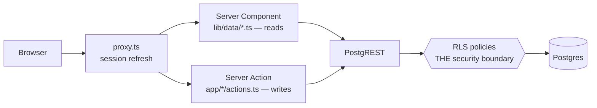

Sergio Betancur Chaves

# Credit Count — Technical Design Document

Track two numbers that must never be confused — **credits** (distinct coasters ridden)
and **rides** (times ridden) — with ride history private by default.

**Live**: `rollercoast-credit-count.vercel.app` 
**Source**: `github.com/sebetancurch/rollercoast-credit-count`
**Stack**: Next.js 16 (App Router) · React 19 · Supabase (Postgres 17, GoTrue, RLS) ·
`@supabase/ssr` · zod · pnpm · vitest + pgTAP

## 1. Architecture

Front-end developed in Nextjs using server components and actions to handle the communication directly to the DB in Supabase. Role based access is controlled directly from the DB engine using RLS (Row Level Security) policies.



![[System Design.png]]

Reads are server components querying directly with no API routes, no useEffect. Writes
are server actions. proxy.ts refreshes the session cookie and redirects. Pages never build a query
themselves: reads go through `lib/data/*.ts`, writes through `app/*/actions.ts`, the
session through `lib/auth/session.ts`, and the schema is in `supabase/migrations/`.

## 2. Data model

![[DB Schema.png]]


Three models were made, profile, coasters and ride, while the credits and the leaderboard are left as a view, while authentication is handled on the Supabase Auth. Three important choices: `ride.coaster_id` is `on delete restrict`, because a cascade
would silently rewrite other people's credit counts. There is no unique constraint on `(user_id, coaster_id, ridden_on)` — repeat rides are the whole point.
`profiles` table has no `email` or `password`since auth owns credentials, and an email.

## 3. Security — RLS is the boundary

The whole user role access is handled by the RLS Policies, nothing in Typescript. The models and view access are summarized in the next subsections.

### 3.1 `ride` — owner only, admins excluded by silence

Four owner policies and **nothing for admins**, so an admin's select returns `[]`
however it is issued.

```sql
create policy "ride: owner reads own" on public.ride for select to authenticated
  using ( (select auth.uid()) = user_id );

-- UPDATE needs both clauses: `using` filters the rows the statement may see,
-- `with check` validates the row it writes. Without the second, a user could
-- move their own ride to somebody else's user_id.
create policy "ride: owner updates own" on public.ride for update to authenticated
  using      ( (select auth.uid()) = user_id )
  with check ( (select auth.uid()) = user_id );
```

### 3.2 `coasters` — read for all, write for admins

Any authenticated user can read the catalogue, but only an admin can write to it. The
admin check was extracted into an `is_admin()` function marked as security definer, so
the policy on `coasters` can look at the `profiles` table without running that table's
own policies from inside a policy. The `search_path` is pinned so a caller cannot shadow
`profiles` with a table of their own and answer the question themselves.

```sql
create or replace function public.is_admin() returns boolean
language sql stable security definer set search_path = '' as $$
  select exists (select 1 from public.profiles
                 where id = (select auth.uid()) and role = 'admin');
$$;
```

### 3.3 The escalation guard — a column privilege, not a policy

A user can edit their own profile but must not be able to make themselves an admin. RLS
only decides which *rows* a statement may touch, it cannot restrict a single column,
because `with check` never sees the old value. This was solved with column privileges
instead: the update grant covers the display name and the leaderboard switch and nothing
else.

```sql
revoke all on public.profiles from anon, authenticated;
grant select                                on public.profiles to authenticated;
grant update (username, leaderboard_opt_in) on public.profiles to authenticated;
```

### 3.4 `public_leaderboard` — definer-rights on purpose

The leaderboard was left as a view so the credits are always counted at the moment they
are read. It aggregates behind the RLS boundary, which is what lets a visitor read the
counts without being given any access to the ride rows underneath. With
`security_invoker` the view would run as the caller instead, and `anon` would need a
select policy on `ride` — exactly what has to stay private.

```sql
create view public.public_leaderboard as
select p.username as display_name, count(distinct r.coaster_id)::int as credit_count
from public.profiles p
join public.ride r on r.user_id = p.id      -- no rides, no row
where p.leaderboard_opt_in = true
group by p.id, p.username;                  -- by id, so two same names never merge

grant select on public.public_leaderboard to anon, authenticated;  -- a view has no
                                           -- policies, so the grants ARE the control
```

The view publishes a display name and a credit count and nothing else. No identifier is
selected, because PostgREST lets a caller filter on any exposed column and a `user_id`
there would turn the public board into a per-user lookup. That is why `p.id` is grouped
on but never selected.

## 4. Auth, writes and derived credits

Authentication is handled entirely by Supabase Auth, so the app never stores an email or
a password. A trigger on `auth.users` called `handle_new_user()` creates the matching
profile row and hardcodes the role as enthusiast and the leaderboard switch as off,
because the signup payload comes from the client and cannot be trusted with either.
Sign-in returns one generic message for every failure, except an unconfirmed account,
which gets its own so the user is not left thinking their password is wrong.

Every write was built as a server action. A server action is a public HTTP endpoint, so
each one reads the session again, validates the payload with zod, and takes the user id
from that session and never from its arguments.

```ts
export async function logRide(input: unknown): Promise<ActionResult> {
  const user   = await requireEnthusiast();        // 1. re-read the session
  const parsed = logRideSchema.safeParse(input);   // 2. parse the payload
  if (!parsed.success) return { ok: false, error: /* … */ };

  await supabase.from("ride").insert({
    user_id: user.id,                              // 3. never from the arguments
    coaster_id: parsed.data.coasterId, ridden_on: parsed.data.riddenOn,
  });
  revalidateRideViews();   // /dashboard, /dashboard/rides, / — no manual refresh step
}
```

```ts
await supabase.auth.getUser();   // never getSession(): that is a cookie the client writes
export const creditCount = (rides) => ridesPerCoaster(rides).size;  // distinct coasters
```

Credits are never written down anywhere. There is no credit_count column and no
credits table: `lib/stats.ts` derives them for the dashboard and the view derives them
for the board, so the two numbers cannot fall out of sync. Logging a ride takes three
interactions — **Log a ride** → pick a coaster → **Save ride** — since the date defaults
to today and the catalogue is filtered in the browser.

## 5. Testing

Testing was split into four layers, since each one can only prove part of it. The
database layers are the ones that matter most, because they check the rules where the
rules actually live.

| Layer           | Location                  | Count   | Proves                                            |
| --------------- | ------------------------- | ------- | ------------------------------------------------- |
| pgTAP           | `supabase/tests/`         | 45      | Policies, grants, constraints, per role           |
| RLS integration | `tests/rls/`              | 34      | The same rules through real JWTs and PostgREST    |
| Unit            | `tests/unit/`             | 49      | Derivation, validation, seed parity — no database |
| Walkthrough     | `scripts/walkthrough.mjs` | 3 roles | Server components + `proxy.ts` + RLS together     |

The way a blocked operation behaves is what decides how each assertion is written: a
blocked select comes back as an empty array with no error, a blocked insert returns
`42501`, and a blocked update or delete affects no rows without raising anything. So a
blocked update is tested as an attempt that succeeds plus a re-read proving the data
never changed.

```sql
-- Refused by column privilege before RLS is consulted at all.
select throws_ok($$update public.profiles set role = 'admin' where id = '…'$$, '42501');
-- Catches a future `select *` quietly publishing a column.
select set_eq($$select column_name from information_schema.columns
                where table_name = 'public_leaderboard'$$, array['display_name','credit_count']);
```

Seed data was created for coasters while an integration with an external API was left out. Seed data for users and rides are also placed to make the app look populated, check the credit calculations work correctly and the whole UI looks fine.

## 6. Limits

**Email Verification:** For testing purpouses, simplicity and free tier limits in Supabase, the email verification was not enabled on purpose, but it is a good authentication step to handle in a production environment.

**Not built, per SOW 4:** live RCDB integration, native apps, password reset beyond
Supabase's own, payments. English only.
